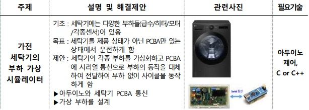
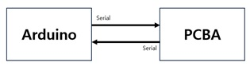
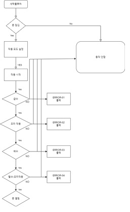
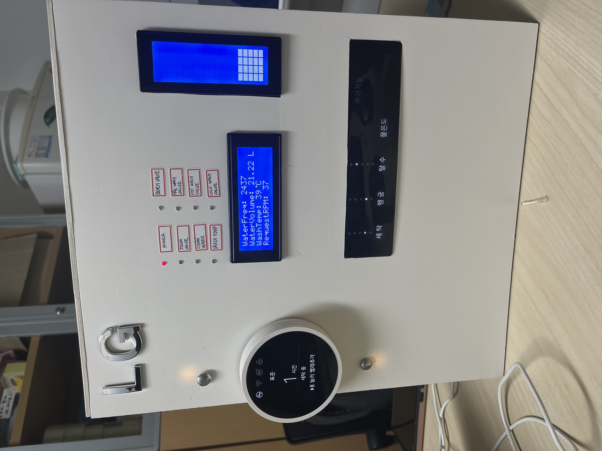
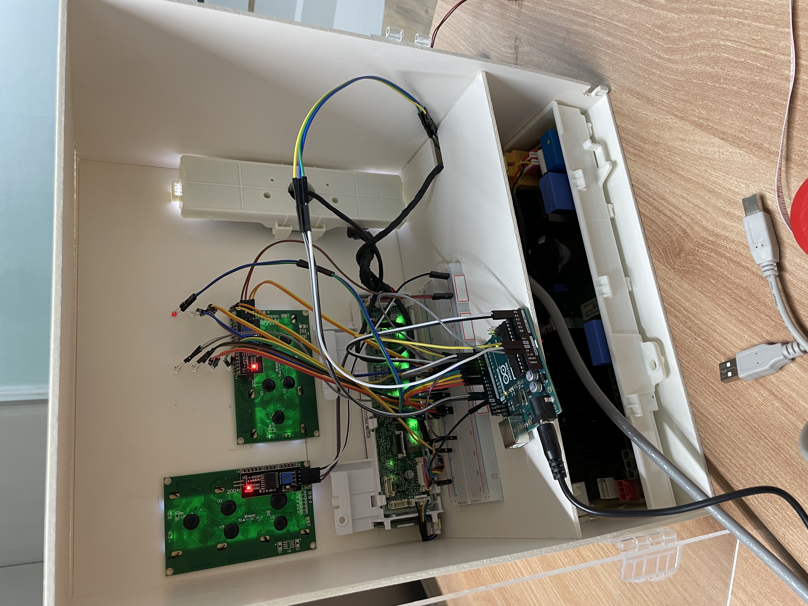
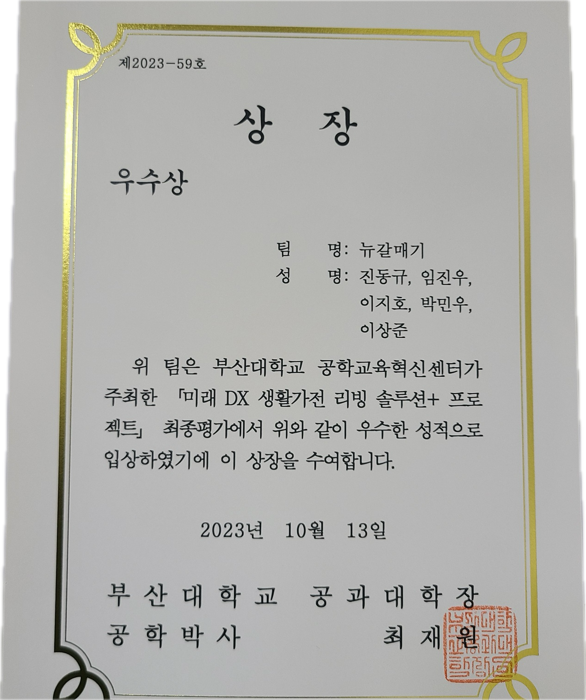

# DXLivingSol - 뉴갈매기팀
```
PCBA와 Serial 통신을 이용한 세탁기 시뮬레이터의 알고리즘 구현 및 결함 분석 도구 개발
부산대학교 공과대학장상 수상 (우수상)
```

## 목적
- 세탁기와 같은 가전을 가동시 각 부하별로 여러 가지 결함이 발생할 수 있다. 이는 전체 시스템에 일시적, 또는 영구적인 결함을 연쇄적으로 유발할 수 있다. 이를 방지하기 위해 세탁기의 각종 부하를 가상화하고 PCBA에 시리얼 통신으로 부하의 동작을 대체 전달하여 부하 없이 사이클을 동작해 제작 전에 미리 예방하고자 한다.

## 아두이노 소스코드
  - [Arduino Code](newseagull/newseagull.ino)

## 실행영상
- [YouTube실행영상](https://youtu.be/bB6cmc3nSY0?si=chS73sMcWqd9CaW8)

## 참고자료
  - 주제 설명 및 해결 제안<br>
  
  - 데이터 흐름 다이어그램<br>
  
  - Flow Chart<br>
  
  - [결과보고서](etc/결과보고서.pdf)
  - [발표자료](etc/결과PPT.pdf)
  - 결과물 사진 전면
  
  - 결과물 사진 후면
  
  - 수상내역
  

